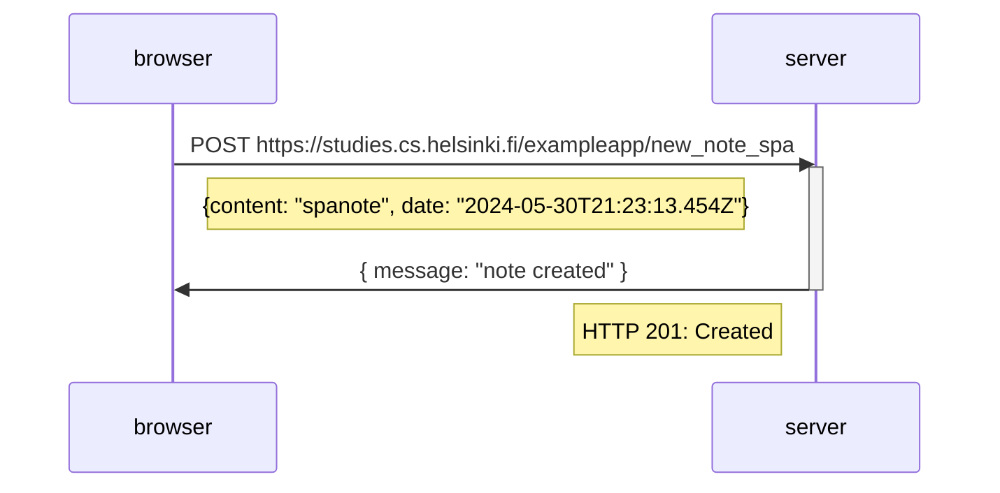

```mermaid

sequenceDiagram
    participant browser
    participant server

    browser->>server: POST https://studies.cs.helsinki.fi/exampleapp/new_note_spa
    activate server

    Note right of browser: {content: "spanote", date: "2024-05-30T21:23:13.454Z"}

    server->>browser: { message: "note created" }
    deactivate server

    Note left of server: HTTP 201: Created
```
